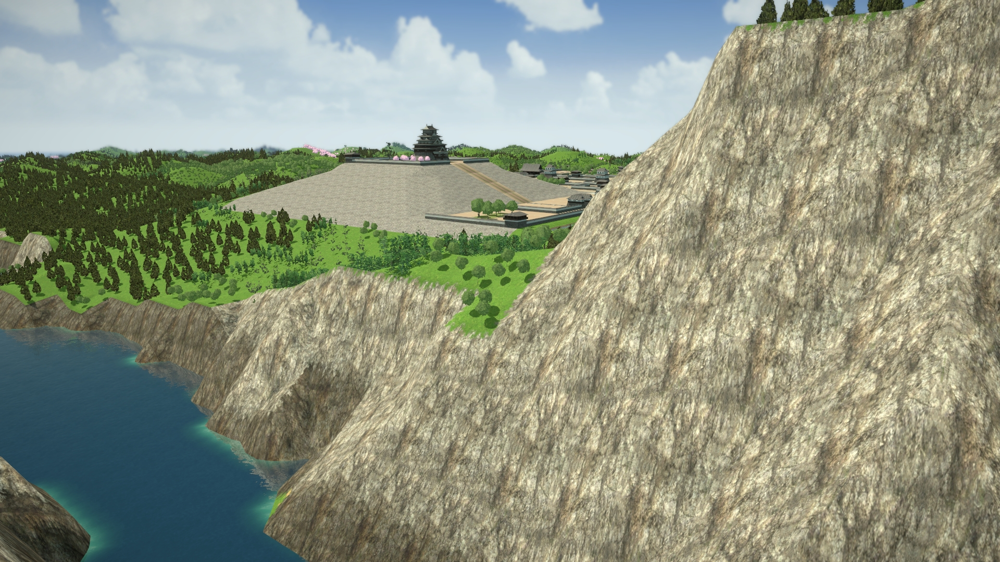
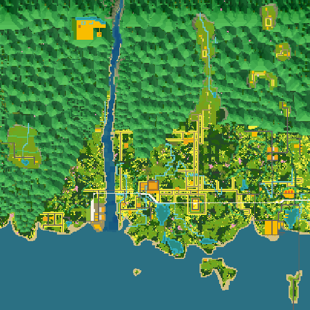

# 渓谷の琵城

## はじめに

「渓谷の琵城」は、
<a href="https://www.artdink.co.jp/japanese/title/a-tourism/" target="_blank">A列車で行こう はじまる観光計画</a>
（はじまるA列車）Steam 版のユーザーシナリオです。

ゲーム内で本シナリオをダウンロードすることにより遊べます。

## シナリオ説明

自治体（琵琶県）と共同で県内の振興を担っている当社。県は大きく分けて、北側の山間部と、南側の沿岸部に区別されます。

前回プロジェクトで南側の沿岸部に産業を誘致することに成功したことから、今回プロジェクトでは、北側の山間部に焦点を当てます（補足：前回プロジェクトに相当するシナリオが別途あるわけではありません）。

鍵を握るのは、渓谷に佇む見晴らしの良いお城、「琵城」です。天然の要害として守りが堅く、領民からも安心のシンボルとして親しまれていたため、伝承も多く残っています。

その琵城に多くの観光客を呼び込み、北側山間部の活性化を図ります。

しかし一方で、軽井沢部長の妄想が広がっていきます。その妄想が経営にも影響を及ぼしたり及ぼさなかったり……？

