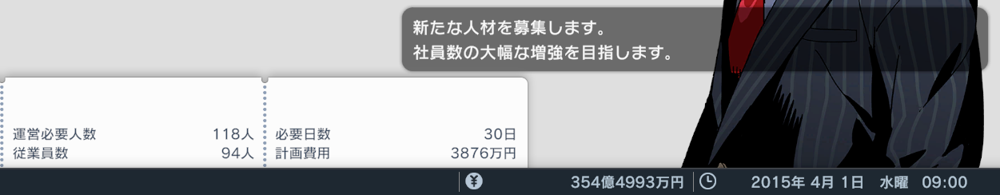

# 渓谷の琵城

## 目次

- [はじめに](#はじめに)
- [シナリオ説明](#シナリオ説明)
- [クリア条件](#クリア条件)
- [リンク](#リンク)
- [よくある質問](#よくある質問)
- [達人攻略例](#達人攻略例)
- [シナリオ作成よもやま話](#シナリオ作成よもやま話)
- [謝辞](#謝辞)
- [ギャラリー](#ギャラリー)

## はじめに

「渓谷の琵城」は、[A列車で行こう はじまる観光計画](https://www.artdink.co.jp/japanese/title/a-tourism/)（はじまるA列車）Steam 版のユーザーシナリオです。

ゲーム内で本シナリオをダウンロードすることにより遊べます。

## シナリオ説明

自治体（琵琶県）と共同で県内の振興を担っている当社。県は大きく分けて、北側の山間部と、南側の沿岸部に区別されます。

前回プロジェクトで南側の沿岸部に産業を誘致することに成功したことから、今回プロジェクトでは、北側の山間部に焦点を当てます（補足：前回プロジェクトに相当するシナリオが別途あるわけではありません）。

鍵を握るのは、渓谷に佇む見晴らしの良いお城、「琵城」。天然の要害として守りが堅く、領民からも安心のシンボルとして親しまれていたため、伝承も多く残っています。

その琵城に多くの観光客を呼び込むことで、北側山間部の活性化を図るのが目的です。

しかし一方で、軽井沢部長の妄想が広がっていきます。その妄想が経営にも影響を及ぼしたり……？  

## クリア条件

このシナリオのクリア条件は以下の通りです。

- 琵賀地区（琵城がある地区）の年間観光客数 88 万人以上
- 黒字決算 2 年連続

なぜこの条件になったかについては、シナリオ内で解説があります。

いずれも 5 年以内（難易度やさしいの場合は 6 年以内）に達成する必要がありますが、難易度達人でも比較的達成しやすいのではないでしょうか。上級者の方は、独自のマイ縛りを付けてプレイしてみてもいいかもしれません。

## リンク

- [Steam サイト内「渓谷の琵城」ページ](https://steamcommunity.com/sharedfiles/filedetails/?id=2798997033)
- [シナリオダウンロード方法（公式ヘルプ）](https://www.artdink.co.jp/manual/a-tourism/steam/ja/start/02-02.html)
- [シナリオダウンロード方法（図解ツイート）](https://twitter.com/shinta0806/status/1507941978582904834)

## よくある質問

### 琵城小噺集が 2 から始まります

琵城小噺集の 1 は、道後さんが話してくれるお話です。

### 木材が使えません

なんとなく（？）で使えないようにしてあります。

代わりと言っては何ですが、シナリオ内で説明がある通り、資源プレイ自体は有用な戦略として用意してあります。むしろ、マップをご覧頂くとわかると思いますが、かなり手厚いサポートになっています。

ちなみに、クリア後は木材も使えます。

### 自作の列車・バスが使えます

ボーナス設計図は「全て」にしてありますので、過去にご自身で別シナリオで開発された列車・バスは、数の許す限り使えるかと思います。

自作シナリオではボーナス設計図を制限しているシナリオも多いのですが、せっかく開発した車両が使える方が楽しいのではないかと思って「全て」にしています。

## 達人攻略例

- [達人攻略例](Strategy.md)（ネタバレになりますので注意）

## シナリオ作成よもやま話

### シナリオスタート時のステータスについて

シナリオ開始直後は従業員数が足りなくなるのがこのゲームの常です。そこで、設定上、従業員充足率を最大の 120% にしています。  

……が、実際にシナリオを開始すると、従業員数が不足しています……。  

後で気付いたことなのですが、難易度達人だとこうなるようです。難易度標準だとぴったりになります。……それでも 120% ではありませんが。

代わりと言っては何ですが、社員状況は MAX（活気に溢れている）にしておきました。また、他のプランと並行で人員増強プランを実行できるよう、営業部規模は最初から 2 件にしてあります。

同様に、ブランド力も設定に関わらず、シナリオ開始時のブランド力がゼロになります。もしかしたらこちらも達人限定だったのかもしれませんが、ヤケになって設定自体でゼロにしたので、最早どの難易度でもゼロになるのかなと思います。

いずれも、Build 30257.629 でのことです。

### 難易度やさしいの調整について

このシナリオの初期資金は、難易度達人でもある程度の自由を持たせる（プレイヤーの発想次第で様々な攻略を試せるようにする）ために、達人としては比較的多くの初期資金を用意しています（制作者が攻略下手である程度資金がないと達人でクリアできないという制作側の事情もありますが）。

そこで問題になるのが、難易度やさしいの初期資金です。デフォルトでは、達人とやさしいでは初期の「資本金」が 3 倍近くの差が出ます。「資本金」で 3 倍なので、手元に残る「資金」としてはもっとずっと大きな差が開きます。

達人資金は 354 億円ですが、デフォルトだとやさしい資金が約 1400 億円となります。これでは初日に全部線路を敷設して、あとは待っているだけでクリアということになりかねません。いくらやさしいとはいえ、これではゲームとは呼べないでしょう。

そこで、やさしい資金をデフォルトの半分、700 億円程度に抑えてあります。ちょっと頑張ればクリアできるかな、くらいのつもりですが、このあたり、皆さんはどう調整しているのか、気になるところです。

## 謝辞

本シナリオ作成に先立ち、先達の皆様のシナリオをいくつかプレイさせていただいており、良い点は積極的に取り入れさせていただいております。先達の皆様に感謝いたします。

## ギャラリー

オフィス街のオアシス  

笹目川の河口  

初期配備されているバスの路線。  

クリア条件  

産業別経済規模  

瀬戸内課長から琵城小噺集を受け取って喜ぶ軽井沢部長  

傾国の美女ではないかと言われて驚く瀬戸内課長  

