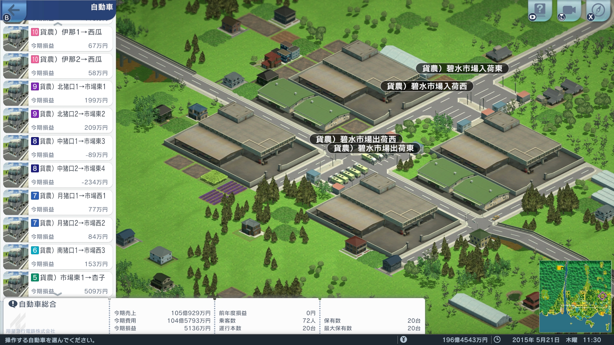
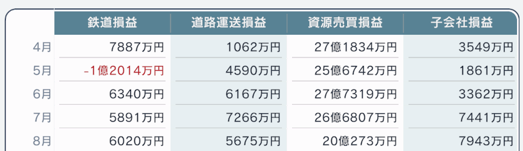
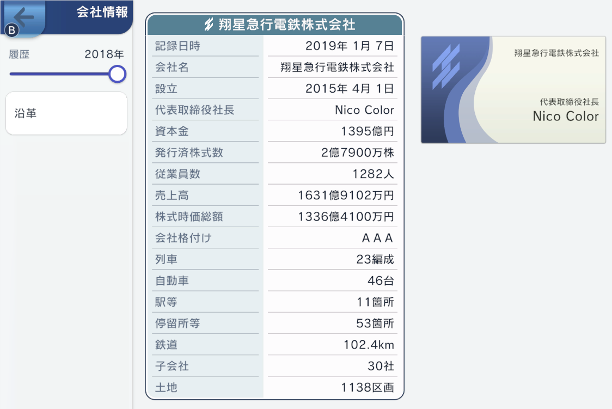

# 達人攻略例

## 攻略例目次

- [基本方針](#基本方針)
- [事業プラン](#事業プラン)
- [びわ入出荷](#びわ入出荷)
- [環状線敷設](#環状線敷設)
- [資材輸送トラック](#資材輸送トラック)
- [地盤固め](#地盤固め)
- [高額配当](#高額配当)
- [琵城路線開通](#琵城路線開通)
- [クリア](#クリア)
- [攻略情報関連リンク](#攻略情報関連リンク)

## 基本方針

クリア条件は

- 琵賀地区（琵城がある地区）の年間観光客数 88 万人以上
- 黒字決算 2 年連続

となっており、まず注目すべきは 88 万人です。

初期資金は 354 億円と達人としては多めのため、プレイヤーにより様々な方針が立てられるのではないかと思いますが、私はシンプルに**全ての隣接都市と琵城を鉄道で結ぶ**という方針にしました。

鉄道敷設に必要な資金はおよそ 1000 億円のため、株式公開により多額の資金を得ることとします。すると必然的にやるべきことは、

- 1 年目（2015 年度）
	- 3 月：黒字決算にする
- 2 年目（2016 年度）
	- 4 月～6 月：費用を節約して利益剰余金のマイナスを避ける
	- 7 月：配当を多めにして株主信頼度を上げる
	- 3 月：黒字決算にする
- 3 年目（2017 年度）
	- 4 月：株式公開手続きを開始する
	- 7 月：全路線を敷設する

となります。これにより、必然的に黒字決算 2 年連続も達成することになります。

株式公開までの間は、沿岸部（蒼水等）を発展させて経営基盤を強化します。  

## 事業プラン

シナリオ開始直後は、プランの「地下鉄道技術獲得」と「人員増強」を同時に行います（最初から 2 件実行できます）。

地下鉄道技術獲得は沿岸路線強化のためです。沿岸にはデフォルトで琵琶線が走っていますが、私は複線より環状線のほうが好きなので、琵琶線を複線にするのではなく、琵琶線を延長して平野部北側を経由する環状線にするのですが、そのためには地下鉄道技術獲得があるほうが敷設しやすいためです。

人員増強についてはシナリオ開始直後の 1 度だけではなく、プランが完了する度に再度人員増強を繰り返します（序盤は常に人員不足になるため）。

ブランド力がゼロのため、人員増強で入社する数は少ないです。資金の余力を見ながら「TV コマーシャル」を併せて実施していきますが、ダイレクトに利益を圧迫するのでやりすぎは禁物です（黒字決算は必須）。

## びわ入出荷

シナリオ内で提案がありますが、山間部の特産品がびわ（農産物）なので、これをさばくための道路等をシナリオ開始直後に敷設します。

西側の伊那地区は、隣街までの道路も既に開通しているので、農業倉庫の近くに駐車場を作るだけです。2 台停まれるようにします。  

東側の猪口地区は、南端の集落のみ隣街に接続されていますが、他の 3 つの集落は孤立しているため、これらを道路で結びます。道路敷設に先立ち、行政施策の猪口道路敷設を受託しておきます。

南端の集落～月形の集落までの道路敷設に 22 億円程度かかります。  

月形の集落～中程の集落までの道路敷設に 16 億円程度かかります。  

中程の集落～北端の集落までの道路敷設に 28 億円程度かかります。  

それぞれの集落の農業倉庫付近に駐車場を作ります。  

各集落のびわを直接隣街に出荷するのではなく、いったん卸売市場の倉庫に集めるようにします。必要に応じて、卸売市場の倉庫から隣街に出荷する形とします。

卸売市場付近の 4 つの農業倉庫をカバーする位置で、入荷用（東側）に 2 つ、出荷用（西側）に 2 つ、合計 4 つの駐車場を作ります。いずれも 5 台停まれるようにします。  

道路と駐車場ができたら、トラックを所有限界に達する 19 台購入し、配置します。内訳は、

- 伊那 → 西瓜（西側隣街）：2 台
- 北猪口 → 市場入荷東：2 台
- 中猪口 → 市場入荷東：2 台
- 月猪口 → 市場入荷西：2 台
- 南猪口 → 市場入荷西：1 台
- 市場出荷東 → 杏子（東側隣街）：4 台
- 市場出荷西 → 日向夏（南側隣街）：5 台

残りの 1 台は別の所で使います。

すべてのトラックの運行計画で、発車条件は貨物待ちにしておきます。また、停車位置はそれぞれ専用とし、他のトラックと停車位置を共用しないようにして、渋滞しないようにします。  

少し手間はかかりますが、これにより、猪口地区のびわは、通常は卸売市場で消費され、杏子や日向夏と契約ができた場合のみ隣街に出荷されますし、契約ごとに運行計画をいじる必要はありません。

資源売買損益の一例です。当初は案件が溜まっていますが、だんだんはけていくため、利益も少なくなっていきます。以降は 5 億円程度の月もありました。とはいえ、初期投資の約 70 億円は 3 ヶ月前後で回収できます。  

## 環状線敷設

地下鉄道技術獲得後、資金が貯まってきたら、琵琶線を延伸して環状線にします。琵琶線を複線にするのが王道かもしれませんが、先にも述べたように個人的に環状線が好きなので、環状線にします。  

平野部の北側を経由する環状線です。単線で杏子（東隣）と接続していたのを複線に変更し、杏林碧水→杏子、杏子→碧水、というように時計回りになるようにします。

麓駅だけ川越えしているのは、将来的に、北にある琵城からの路線との乗換駅とすることを見越しています。

川越えのために初期配備の貨物路線を使用したため、貨物列車は撤去しました。併せて、基州工業団地駅（貨物駅）も撤去です。

杏子も含めて 9 駅なので 9 編成、1 編成当たり 3 両の環状線を走行させます。名称も琵琶中央環状に改めます。

## 資材輸送トラック

撤去した貨物列車の代わりに資材を運ぶため、工業団地から蒼水までトラックを走らせます。まとめ買いした時に残っていた 1 台です。

はじまる A 列車では資材が無くても街はできますが、建設する自社子会社や、あるいは他社子会社も早期に完成させるための半ばボランティアとして、主要な駅周辺には資材を供給するようにしています。

## 地盤固め

新駅は赤字になりがちなため、車両保管庫拡張後にバスを走らせたりして街を発展させ、収益基盤を強化します。

なぜか初期段階では、そこそこ発展しているはずの蝶舞駅が赤字で、あまり発展していない笹目口駅が黒字でした。

笹目口駅には CPU が積極的に子会社を建設していました。学校が良い影響を与えていたのか、地形的な何かがあったのか……。

1 年目の決算が必ず黒字になるよう、特に水物の支出のしすぎには注意します。

## 高額配当

2 年目、2016/07/01 の配当は 25 円、5% 利回りにして、株主信頼度を 5 にします。

## 琵城路線開通

2 年目を黒字決算で終え、翌 2017/04/01 より株式公開を進めると、2017/07/30 に株式が公開されて 800 億円程度の資金を得ることができるので、琵城へのアクセス鉄道を敷設します。

琵城を経由し、南北の隣街（日向夏、葡萄）へと観光客を運ぶ南北線を敷設します。

南北線の琵城前駅です。

日向夏（南隣）までひたすら鉄橋を延ばします。

杏子（東隣）へは麓駅で乗り換えます。

撤去した貨物駅の基州工業団地駅があった辺りに、旅客駅としての基州工業団地駅を建設し、西瓜（西隣）への乗換駅とします。

基州工業団地駅から西瓜までの路線を敷設します。

琵琶中央環状については、2 年の時を経て沿線が発展したので、4 両編成の新車にリプレースします。

南北線および基瓜線（基州工業団地駅～西瓜）については、琵琶中央環状からの払い下げを含め、3 両編成で走らせます。

基瓜線は赤字路線になりますが、琵琶中央環状などの安定基盤があるため経営は問題無く行えるかと思います。

## クリア

すべての隣接都市からの観光客を受け入れられるようになったことで、4 年度の 2019/01/07 に観光客 100 万人を達成し、クリアすることができました。

売上の推移です。

損益の推移です。

クリア時点の貸借対照表です。

会社情報です。

## 傾国の美女イベント

軽井沢部長の妄想に付き合い、誰を傾国の美女と思うかによって、1 周年（2 年目の 4 月）時点で資金が変動します。

実は一番得をするのは、瀬戸内課長のみを傾国の美女と思った場合です。1 周年で 30 億円を失いますが、特別に 2 周年で 100 億を得るので、トータル 70 億円の得となります。

一番損をするのは、全員を傾国の美女と思った場合です。20 億円を失います。

## 攻略情報関連リンク

はじまる A 列車の攻略に役立つリンク集です。

- [A列車で行こう はじまる観光計画 総合wiki](https://w.atwiki.jp/hajimaruatrain/)
- [A列車で行こう はじまる観光計画 攻略](https://www.spoiler.jp/srv/a-tourism/)
- [簡単単線ダイヤ「片方到着待ち作戦」](https://twitter.com/shinta0806/status/1509042935207129091)

